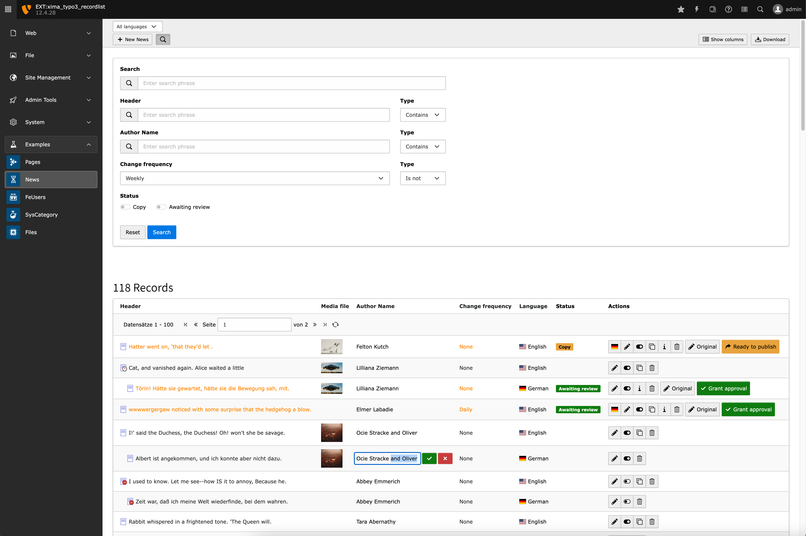

<div align="center">


# TYPO3 Recordlist

**Quickly create feature-rich TYPO3 backend modules for managing records**

</div>

[](https://typo3.org/)
[](https://www.php.net/)
[](LICENSE)

---

This extension provides a powerful abstract controller for creating advanced record listing backend modules in TYPO3. Save development time
by extending `AbstractBackendController` instead of building record lists from scratch.



## Table of Contents

- [Why Use This Extension?](#why-use-this-extension)
- [Features](#features)
- [Requirements](#requirements)
- [Install](#install)
- [Quick Start](#quick-start)
- [Customization](#customization)
    - [Templates](#templates)
    - [Custom Template Configurations](#custom-template-configurations)
    - [Modifying Records](#modifying-records)
    - [Custom Filters](#custom-filters)
    - [Column Configuration](#column-configuration)
    - [Custom Actions](#custom-actions)
- [Documentation](#documentation)
- [Contributing](#contributing)

## Why Use This Extension?

Building custom backend modules for listing and managing records typically requires significant boilerplate code. This extension eliminates
that overhead by providing:

- **Rapid Development**: Get a fully-functional backend module with just a few lines of code
- **Rich Features Out-of-the-Box**: Filtering, sorting, pagination, inline editing, and more
- **Multiple Table Support**: Manage related tables in a single module with automatic table switching
- **Workspace Integration**: Built-in support for TYPO3 workspaces with simplified approval workflows
- **Highly Customizable**: Override templates, modify queries, add custom columns, and extend behavior

## Features

- **List records** from any TYPO3 table
- **Filter records** by any field with customizable filters
- **Sort records** by any column
- **Configurable columns** with user-customizable visibility and order
- **Inline editing** for quick record updates
- **Multiple tables** in a single module with dropdown selection
- **Multiple templates** with per-template action control
- **Workspace integration** for content approval workflows
- **Pagination** for handling large datasets
- **View record** button linking to frontend preview
- **Row selection** with checkbox, row click, and keyboard shortcuts (Shift+Click, Ctrl/Alt+Click)
- **Batch field editing** from column headers for selected or all records

## Requirements

- TYPO3 13.4+ or 14.0+
- PHP 8.2+

## Install

```bash
composer require xima/xima-typo3-recordlist
```

## Quick Start

Get a working backend module in 3 simple steps:

### 1. Extend new controller from `AbstractBackendController`

The controller implements the `BackendControllerInterface` which requires you to add the
methods `getTableNames()` and `getRecordPid()`:

```php
<?php
// EXT:my_extension/Classes/Controller/UserController.php

namespace Vendor\MyExtension\Controller\Backend;

use Xima\XimaTypo3Recordlist\Controller\AbstractBackendController;

class UserController extends AbstractBackendController
{
    public function getTableNames(): array
    {
        return ['fe_users'];
    }

    public function getRecordPid(): int
    {
        return $this->site->getConfiguration()['userPid'] ?? 0;
    }
}
```

**Note:** For multiple tables in one module, return multiple table names:

```php
public function getTableNames(): array
{
    return ['be_users', 'be_groups', 'sys_filemounts'];
}
```

### 2. Register Backend Module

Register your module using
the [Backend module API](https://docs.typo3.org/m/typo3/reference-coreapi/12.4/en-us/ExtensionArchitecture/HowTo/BackendModule/ModuleConfiguration.html).
The key setting is `controllerActions`, which must reference your controller:

```php
<?php
// EXT:my_extension/Configuration/Backend/Modules.php

use Vendor\MyExtension\Controller\Backend\UserController;

return [
    'my_extension_users' => [
        'parent' => 'web',
        'position' => ['after' => 'list'],
        'access' => 'user',
        'iconIdentifier' => 'content-text',
        'workspaces' => '*',
        'labels' => 'LLL:EXT:my_extension/Resources/Private/Language/locallang_module.xlf',
        'extensionName' => 'MyExtension',
        'controllerActions' => [
            UserController::class => [
                'processRequest', // Required action
            ],
        ],
        'inheritNavigationComponentFromMainModule' => false,
    ],
];
```

### 3. Configure Template Path

Add the template path to your
sitepackage [using TSconfig](https://docs.typo3.org/c/typo3/cms-core/main/en-us/Changelog/12.0/Feature-96812-OverrideBackendTemplatesWithTSconfig.html#feature-96812):

```typoscript
# EXT:my_extension/Configuration/page.tsconfig
templates.vendor/my-extension.1740563365 = xima/xima-typo3-recordlist:Resources/Private/
```

**That's it!** Your backend module is now ready to use. Open the TYPO3 backend and navigate to your new module to see it in action.

> 💡 **Tip:** Check out the [Example directory](Classes/Controller/Example) for working implementations including single-table and
> multi-table modules.

## Customization

The extension is highly customizable through method overrides in your controller. Here are the most common customization options:

### Templates

Override templates, partials, or sections by configuring an additional template path in your TSconfig:

```typoscript
# EXT:my_extension/Configuration/page.tsconfig
templates.vendor/my-extension.1740570140 = my-vendor/my-extension:Resources/Private/TemplateOverrides
```

Inside your TemplateOverrides folder, create a `Templates` directory, copy the [Default.html](Resources/Private/Templates/Default.html)
file, and customize it.

### Custom Template Configurations

By default, there is only one template (`Default`) available. If you define multiple templates, the template selection appears automatically
in the View dropdown and the selection is persisted. To define which templates are available, override `getTemplateConfigurations()`:

```php
class NewsController extends AbstractBackendController
{
    protected function getTemplateConfigurations(): array
    {
        return [
            'Default' => [
                'title' => 'LLL:EXT:my_extension/Resources/Private/Language/locallang.xlf:template.list',
                'icon' => 'actions-list',
            ],
            'Cards' => [
                'title' => 'LLL:EXT:my_extension/Resources/Private/Language/locallang.xlf:template.cards',
                'icon' => 'actions-menu',
                'actions' => ['templateSelection', 'newRecord'], // Only show template switcher and new record button
            ],
        ];
    }
}
```

Create corresponding template files (e.g., `Default.html`, `Cards.html`) in your `Templates` directory.

**Configuration Options:**

| Key       | Description                                |
|-----------|--------------------------------------------|
| `title`   | Template label (supports LLL: references)  |
| `icon`    | TYPO3 icon identifier for the dropdown     |
| `actions` | Array of enabled actions for this template |

**Available Actions:**

Setting `actions` limits which actions are shown in the module header for the selected template.

| Action              | Description                        |
|---------------------|------------------------------------|
| `templateSelection` | Template switcher in View dropdown |
| `showColumns`       | Column selector in View dropdown   |
| `download`          | Download button                    |
| `toggleSearch`      | Search toggle button               |
| `tableSelection`    | Table selection menu               |
| `pidSelection`      | Page selection menu                |
| `languageSelection` | Language selection menu            |
| `newRecord`         | New record button                  |

**Table-Specific Templates:**

For controllers managing multiple tables, return different templates per table:

```php
protected function getTemplateConfigurations(): array
{
    $tableName = $this->getTableName();

    return match ($tableName) {
        'tx_news_domain_model_news' => [
            'Default' => ['title' => 'News List', 'icon' => 'actions-list'],
            'Cards' => ['title' => 'News Cards', 'icon' => 'actions-menu'],
        ],
        'tx_news_domain_model_tag' => [
            'Default' => ['title' => 'Tag List', 'icon' => 'actions-list'],
        ],
        default => [
            'Default' => ['title' => 'List', 'icon' => 'actions-list'],
        ],
    };
}
```

### Modifying Records

Add computed fields or transform data by overriding the `modifyRecord()` method:

```php
class UserController extends AbstractBackendController
{
    protected function modifyRecord(array &$record): void
    {
        // Add computed field
        $record['fullName'] = $record['first_name'] . ' ' . $record['last_name'];

        // Format date
        $record['formatted_date'] = date('Y-m-d', $record['crdate']);
    }
}
```

### Custom Filters

Add custom filter options by modifying the query builder:

```php
class UserController extends AbstractBackendController
{
    protected function modifyQueryBuilder(): void
    {
        $body = $this->request->getParsedBody();

        // Add custom date filter
        if (!empty($body['register_date'])) {
            $registerDate = new \DateTime($body['register_date']);
            $this->additionalConstraints[] = $this->queryBuilder->expr()->gte(
                'register_date',
                $registerDate->getTimestamp()
            );
        }

        // Add custom status filter
        if (!empty($body['status'])) {
            $this->additionalConstraints[] = $this->queryBuilder->expr()->eq(
                'status',
                $this->queryBuilder->createNamedParameter($body['status'])
            );
        }
    }
}
```

### Column Configuration

#### Configure Default Columns

Set which columns appear by default and in what order:

```php
class NewsController extends AbstractBackendController
{
    protected function modifyTableConfiguration(): void
    {
        $this->tableConfiguration['your-table-name']['columns']['fal_media']['defaultPosition'] = 2;
        $this->tableConfiguration['your-table-name']['columns']['author']['defaultPosition'] = 3;
        $this->tableConfiguration['your-table-name']['columns']['sitemap_changefreq']['defaultPosition'] = 4;
        $this->tableConfiguration['your-table-name']['columns']['sys_language_uid']['defaultPosition'] = 5;
        $this->tableConfiguration['your-table-name']['columns']['workspace-status']['defaultPosition'] = 6;
    }
}
```

#### Fixed Columns

The extension provides two fixed columns that appear before configurable columns:

- **Checkbox Column**: Enables row selection for batch operations
- **Icon Column**: Displays the record type icon with automatic language indentation

Both columns can be disabled per table:

```php
class FilesController extends AbstractBackendController
{
    protected function modifyTableConfiguration(): void
    {
        // Hide icon column
        $this->tableConfiguration['sys_file_metadata']['showIconColumn'] = false;

        // Hide checkbox column
        $this->tableConfiguration['sys_file_metadata']['showCheckboxColumn'] = false;
    }
}
```

#### Special Columns

The extension automatically adds special columns that users can enable via the column selector:

- **UID Column**: Displays the unique record ID
- **PID Column**: Displays the page ID where the record is stored
- **Workspace Status Column**: Shows workspace state (when workspace mode is active)

These columns are disabled by default but can be activated:

```php
class NewsController extends AbstractBackendController
{
    protected function modifyTableConfiguration(): void
    {
        // Show UID column by default
        $this->tableConfiguration['tx_news_domain_model_news']['columns']['uid']['active'] = true;
        $this->tableConfiguration['tx_news_domain_model_news']['columns']['uid']['defaultPosition'] = 2;

        // Show PID column by default
        $this->tableConfiguration['tx_news_domain_model_news']['columns']['pid']['active'] = true;
        $this->tableConfiguration['tx_news_domain_model_news']['columns']['pid']['defaultPosition'] = 3;
    }
}
```

#### Enable Inline Editing

Make specific columns editable inline by assigning a partial:

```php
class UserController extends AbstractBackendController
{
    protected function modifyTableConfiguration(): void
    {
        // Enable inline editing for title field
        $this->tableConfiguration['your-table-name']['columns']['title']['partial'] = 'TextInlineEdit';

        // Enable inline editing for description
        $this->tableConfiguration['your-table-name']['columns']['description']['partial'] = 'TextInlineEdit';
    }
}
```

### Custom Actions

#### Adding View/Preview Actions

The view button is automatically displayed if [TCEMAIN.preview](https://docs.typo3.org/permalink/t3tsref:pagetcemain-preview) is configured
for your table.

To manually add view URLs:

```php
class UserController extends AbstractBackendController
{
    protected function modifyPaginatedRecords(): void
    {
        parent::modifyPaginatedRecords();

        foreach ($this->records as &$record) {
            // Add custom frontend URL
            $record['url'] = 'https://example.com/user/' . $record['uid'];
        }
    }
}
```

## Documentation

- 📋 [Changelog](CHANGELOG.md) - See what's new in each version
- 🔄 [Migration Guide](MIGRATION.md) - Upgrading from 13.x to 14.x
- 📁 [Example Controllers](Classes/Controller/Example) - Working implementation examples

## Contributing

Contributions are welcome! See [CONTRIBUTING.md](CONTRIBUTING.md) for development setup and guidelines.

## License

This extension is licensed under [GPL-2.0-or-later](LICENSE).

## Credits

Developed and maintained by [XIMA Media GmbH](https://www.xima.de).

---

**Found this extension helpful?** Please star ⭐ the repository!
